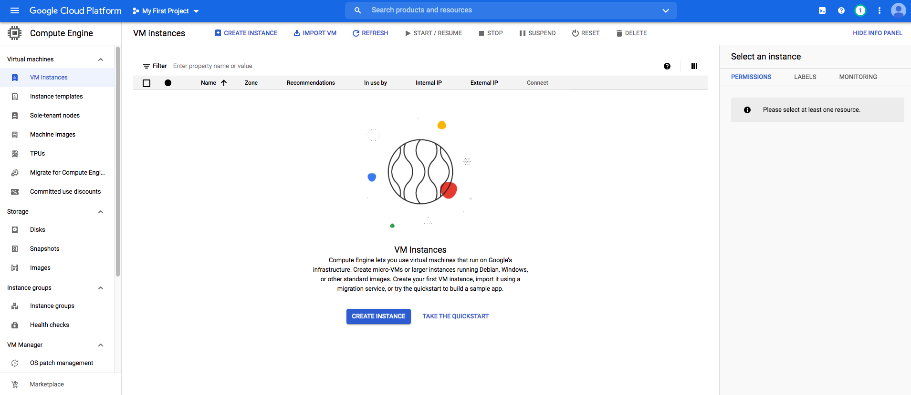
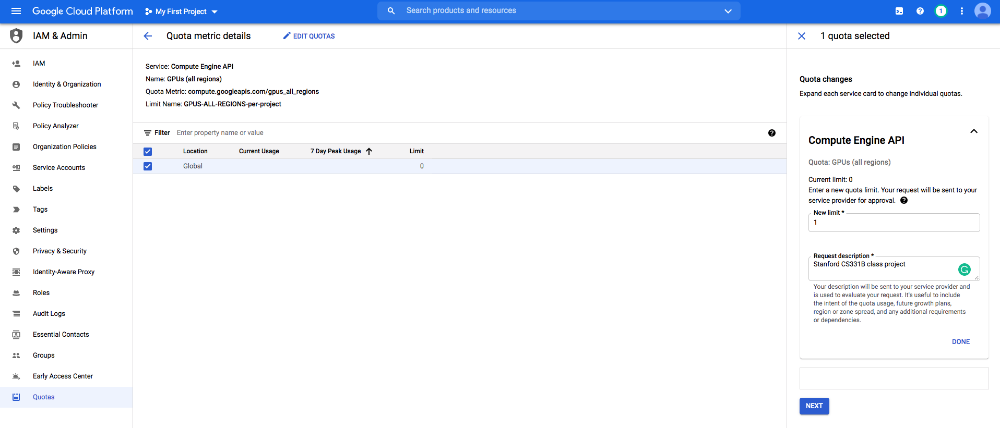

# Google Cloud Setup and Tutorial

(Last Update on March 26, 2021)


# Table of contents

1. [Overview](#overview)
2. [Create and Configure Your Account](#create-and-configure-your-account)
    1. [Sign Up GCP for the First Time](#sign-up-gcp-for-the-first-time)
    2. [Configure Your Project](#configure-your-project)
3. [Request an Increase in GPU Quota](#request-an-increase-in-gpu-quota)  
5. [Set Up Google Cloud VM Image](#set-up-google-cloud-vm-image)
    1. [Customize VM Hardware](#customize-vm-hardware)
    2. [Configure Networking](#configure-networking)
6. [Access Your Newly created VM](#access-your-newly-created-vm)
    1. [Install gcloud Command Line and Connect To Your VM Instance](#install-gcloud-command-line-and-connect-to-your-vm-instance)
    2. [Verification](#verification)
7. [Remote Server Development](#remote-server-development)
    1. [Using Jupyter Notebook with Google Compute Engine](#using-jupyter-notebook-with-google-compute-engine)
    2. [Using Tensorboard with Google Compute Engine](#using-tensorboard-with-google-compute-engine)
    3. [Transferring Files From Your Instance To Your Computer](#transferring-files-from-your-instance-to-your-computer)
    4. [Other Tips](#other-tips)
    

## Overview 

For your class project, we recommend setting up a GPU instance on GCP (Google Cloud Platform).

### BIG REMINDER: Make sure you stop your instances! 

(We know you won't read until the very bottom once your assignment is running, so we are printing this at the top too since it is ***super important***)

Don't forget to ***stop your instance*** when you are done (by clicking on the stop button at the top of the page showing your instances), otherwise you will ***run out of credits*** and that will be very sad. :(

If you follow our instructions below correctly, you should be able to restart your instance and the downloaded software will still be available.

### Colab vs GCP 

While [Colab](https://research.google.com/colaboratory/faq.html) is good for assignments, and  is still a helpful and free tool for experimentation for your project, you will likely need a dedicated GPU instance when you start training on large datasets and collaborating as a team:
- Colab will disconnect after 12 hours or ~30 min of idling (and you will lose your unsaved data). A GCP VM instance will not disconnect untill you stop it (or run out of credits).  
- A GCP VM instance's disk space allows you to deal with larger datasets. In Colab's case, you will have to save all your data and models to Google Drive.
- Colab does not innately support real-time collaboration.
- You can choose your GPU models and can set >1 GPUs for distributed training on GCP.

## Create and Configure Your Account

**You should use your personal GMail account for GCP, i.e. NOT SUID@stanford.edu, because Stanford University managed email accounts do not support creating a new project.** 

For the class project, we offer students **$50 GCP coupons** for each student to use Google Compute Engine for developing and testing your
implementations. When you first sign up on GCP, you will have $300 free credits.

If your credits ends up not being enough, contact course staff on Piazza. We will also send out forms for extra GCP credit request form later in the quarter.
 
This tutorial lists the necessary steps of working on the projects using Google Cloud. **We expect this tutorial to take up to an hour. Don't get intimidated by the steps, we tried to make the tutorial detailed so that you are less likely to get stuck on a particular step. Please tag all questions related to Google Cloud with google_cloud on Piazza.**

### Sign Up GCP for the First Time

You should receive $300 credits from Google when you first sign up with **Personal GMail** and **also UPGRADE it into a full account**. 
Please try to use the resources judiciously. 

1. Create Google Cloud account by going to the [Google Cloud homepage](https://cloud.google.com/?utm_source=google&utm_medium=cpc&utm_campaign=2015-q2-cloud-na-gcp-skws-freetrial-en&gclid=CP2e4PPpiNMCFU9bfgodGHsA1A "Title"). Click on the blue **Get Started for free** button. Sign into your Gmail account. Here is an illustrative example.


2. Choose **Account type** to be **Individual**. You will then fill in your name, address and credit card information.


3. Click the "Google Cloud Platform" (in red circle), and it will take you to the main project dashboard:


### Configure Your Project 

1. On the main project dashboard, you can change the name of your project by clicking **Go to project settings**. Take a note of your project ID.


2. To add project collaborators, click **ADD PEOPLE TO THIS PROJECT**. Add their email and make their role owners. 


3. **Upgrade your account** in order to use GPUs following this [instruction](https://cloud.google.com/free/docs/gcp-free-tier#how-to-upgrade). Otherwise [Google Cloud Free Tier](https://cloud.google.com/free/docs/gcp-free-tier#how-to-upgrade) does not come with GPU support or quota.

4. Go to **Billing** and click "Upgrade" on the "Credits" section at the bottom right corner.
An upgraded account should look like this.


## Request an Increase in GPU Quota

Your account typically does not come with GPU quota. You have to explicitly request for it under **IAM Admin** > **Quotas**. 

**Please request the quota increase ASAP**, because they will take up between couple minutes to a week to process!  If you don't have GPU quota, you will have to create a CPU-only VM first and create another GPU VM later, explained in the next section.

1. Enable VM instances. Go to **Compute Engine** > **VM instances** and click "Enable". Then you should see something like this.


2. Change your quota of **GPUs (all regions)**. Search "GPU" in the search bar and scroll all the way down. You should see **GPUs (all regions)** and click **ALL QUOTAS**.


3. Select the quota with **Location: Global** and click **EDIT QUOTAS**. Then put in "1" in the "New limit" text box and proceed to "Next".


4. Wait until GCP send you the second email (the first email is just to notify they receive the request) that looks like this. It could take couple minutes to couple days for them to approve.
 


## Set Up Google Cloud VM Image

### Customize VM Hardware 

1. Go to [Create Instance](https://console.cloud.google.com/compute/instancesAdd). You will see a page where you can customize specifications to create a VM instance.
2. Fill in `Name` field with your preferred VM name, e.g. `cs331b`.
3. In `Machine configuration` part, Customize following the screenshot below.
4. Choose your desired number of CPUs and memory. If you need to run iGibson, 8 vCPUs, 32 GB memory would be the minimum. 
5. Set `Number of GPUs` to 1 since we will need GPU to run iGibson.
6. For `GPU type`, `NVIDIA Tesla K80` is typically enough. `P100` and `V100` are way more expensive (check the price on the right), but also faster and has larger memory. Check [pricing and spec for GCP GPUs](https://cloud.google.com/compute/gpus-pricing). 
    **GPU drivers and CUDA will be automatically installed _only if_ you select at least 1 GPU**.
    
    Alternatively, you can choose *None* if you are not in need of GPU resources yet (you can always add on later) to save cost, and in this case GPU drivers and CUDA will not be installed.
5. In `Boot disk` field, change to `Public images -> Deep Learning on Linux -> Deep Learning Image: Base m66 CUDA 11.0`. Select at least 100GB Memory.
6. Check the box `Allow HTTP traffic` and `Allow HTTP traffic` since we will be using tensorboard and jupyter notebook.
7. Leave all other options as default.
8. Click the blue botton `Create` at the end of the page. It will **Automatically Start your Instance**, so if you don't need to use it now, **Stop it Immediately**.


Your configuration sheet should look similar to below image. Follow exactly the same configuration for the ones with red boxes. For configurations with orange boxes, you can adjust it based on your project need as discussed below. 

Pay attention to the monthly price, make sure you claim only necessary HW resources, so that you can use your GCP instance for longer. 
**Once you run out of credits, the VM instance will be shut down automatically and you might lose unsaved data and models.** If you are almost running out of credits, contact the course staff.


#### Change Configuration on Already Created VM Instances
1. You can always change number of CPUs, number of GPUs, CPU memory, and GPU type **after your VM has been created**. 

2. Just stop your instance, go to your VM instance's details at **Compute Engine** > **VM instances** > [click on instance name]. 

3. Click "edit" on your VM's page to modify the settings. Finally click "Save".

### Configure Networking

Wait until the deployment is finished. You should see a running VM with a green checkmark next to it on your [Compute Engine page](https://console.cloud.google.com/compute/).

We need to tweak a few more settings to enable remote access to Jupyter notebooks.

1. Go to [Firewall config page](https://console.cloud.google.com/networking/firewalls).
2. Click "CREATE FIREWALL RULE"
3. Give it an arbitrary name, such as `cs331b`.
4. In `Targets` field, select `All instances in the network`.
5. In `Source IP ranges`, enter `0.0.0.0/0`.
6. In `Protocols and ports` field, select "Specified protocols and ports". Then check `tcp` and enter `7000-9000`.
7. Click the blue button `Create`.
8. Restart your instance on the Compute Engine page.

Your configuration sheets should look similar to below:


#### Getting a Static IP Address
If you want to have a static IP for ease of access, you can change the External IP address of your Google Cloud Engine instance to be static (see screenshot below).


To Do this, click on the 3 line icon next to the **Google Cloud Platform** button on the top left corner of your screen, go to **VPC network** > **External IP addresses** (see screenshot below).


To have a static IP address, change **Type** from **Ephemeral** to **Static**. Enter your prefered name for your static IP, ours is `cs331b-ip` (see screenshot below). And click on Reserve. 

**NOTE:** At the end of CS 331B when you don't need your instance anymore, **release the static IP address because Google charges a small fee for unused static IPs** (according to [this page](https://jeffdelaney.me/blog/running-jupyter-notebook-google-cloud-platform/)).


Take note of your Static IP address (circled on the screenshot below). We use 35.185.240.182 for this tutorial.


## Access Your Newly Created VM 

Now that you have created your virtual GCE, you want to be able to connect to it from your computer. The rest of this tutorial goes over how to do that using the command line. 

### Install gcloud command-line and connect to your VM instance
1. Install [Google Cloud SDK](https://cloud.google.com/sdk/docs/install).
2. Log in using `gcloud auth login`. It will ask you to copy/paste a link to your browser. Authenticate using the same gmail account that you used for this tutorial and then copy the code and paste it in your terminal after the prompt `Enter verification code:`
3. Set the current project using `gcloud config set project <PROJECT_ID>`
4. Connect to your VM instance using `gcloud compute ssh <INSTANCE_NAME>`
5. If you connect for the first time, you will be asked "Would you like to install the Nvidia driver?". Input `y`. It should take 1 min or so. 
6. Run the setup script. This is optional unless you want to use jupyter notebook.

```bash
git clone https://github.com/ChengshuLi/gcloud.git
cd gcloud/
chmod u+x setup.sh
./setup.sh
```

### Verification

If you have GPU enabled, you should be able to:

* run `nvidia-smi` and see the list of attached GPUs and their usage statistics. Run `watch nvidia-smi` to monitor your GPU usage in real time.
* first `pip install torch` and then inside the `gcloud/` folder, run `python verify_gpu.py`. If your GPU is attached and CUDA is correctly installed, you shouldn't see any error.

## Remote Server Development

### Using Jupyter Notebook with Google Compute Engine 

Start Jupyter Notebooks
```
jupyter notebook
```

The default port is `8888`, specified in `~/.jupyter/jupyter_notebook_config.py`.

You can connect to your Jupyter session from your personal laptop. Check the external ip address of your instance, say it is `35.185.240.182`. Open any browser and visit `35.185.240.182:8888`. The login password is the one you set with the setup script above.

### Using Tensorboard with Google Compute Engine
Start Tensorboard
```
tensorboard --logdir . --port 8000 --bind_all
```
Visit `<external_ip>:8000` on your browser to access the Tensorboard.

### Transferring Files From Your Instance To Your Computer

For instance, to transfer `file.zip` from GCE instance to your local laptop. There is an [easy command](https://cloud.google.com/sdk/gcloud/reference/compute/scp) for this purpose:

```
gcloud compute scp <user>@<instance-name>:/path/to/file.zip /local/path
```

For example, to download files from our instance to the current folder:

```
gcloud compute scp tonystark@cs331b:/home/shared/file.zip .
```

The transfer works in both directions. To upload a file to your instance:

```
gcloud compute scp /my/local/file tonystark@cs331b:/home/shared/
```

If you would like to transfer an entire folder, you will need to add a resursive flag: 
```
gcloud compute scp --recursive /my/local/folder tonystark@cs331b:/home/shared/
```

### Other Tips
You can use [Tmux](https://linuxize.com/post/getting-started-with-tmux/) to keep the training sessions running when you close your laptop. Also, if your collaborators log into the same account on the VM instance, they will see the same tmux session screen in real time. 

You can develop your code on remote server directly if you are comfortable with vim or emac.

You can develop locally on your favorite editor, push to your branch on Github, and pull on remote server to run.
(git commit frequently is also one of [good Github practices](https://www.datree.io/resources/github-best-practices))

Besides `gcloud compute scp`, another tool you can check out is [rsync](https://linuxize.com/post/how-to-use-rsync-for-local-and-remote-data-transfer-and-synchronization/) which can synchronize files and folders between your local machine and remote server. 


## BIG REMINDER: Make sure you stop your instances! ##

Don't forget to stop your instance when you are done (by clicking on the stop button at the top of the page showing your instances). You can restart your instance and the downloaded software will still be available.

We have seen students who left their instances running for many days and ran out of credits. You will be charged per hour when your instance is running. This includes code development time. We encourage you to read up on Google Cloud, regularly keep track of your credits and not solely rely on our tutorials.
